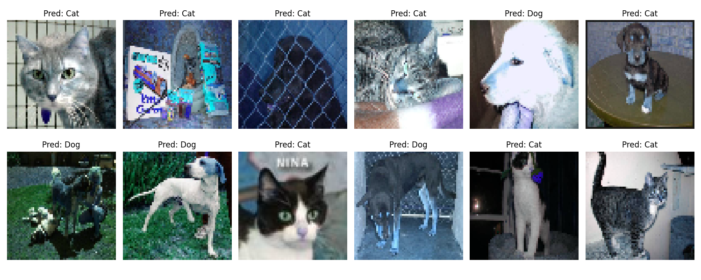

# 🐾 SVM Cat vs Dog Classifier

This is Task 03 for the SkillCraft Technology Machine Learning Internship.  
I built an image classifier using Support Vector Machines (SVM) to distinguish between cats and dogs.

## 🔧 How it works
- Dataset: Kaggle Cats vs Dogs
- Preprocessing: Resize to 64×64, flatten pixels
- Model: SVM with RBF kernel, optional PCA
- Evaluation: Accuracy, classification report, confusion matrix

## 📊 Sample Predictions
Here’s a grid of test images with predicted labels:

## 📈 Results
- Accuracy: 67.28%
- Confusion Matrix: see `results/confusion_matrix.png`
-  Classification Report:
 Cat → Precision: 0.66, Recall: 0.71, F1: 0.69
 Dog → Precision: 0.69, Recall: 0.63, F1: 0.66




## 📁 Repo Structure
src/         # training and utility scripts
models/      # saved SVM model (.pkl)
results/     # evaluation outputs and prediction grid
data/        # local dataset (ignored in GitHub)

## 🌱 For Beginners
This project is designed to be simple and reproducible.
Even if you’re new to ML, you can run the code and see how SVMs classify cats vs dogs.


## 🚀 Run the model
```bash
python src/train_svm.py


